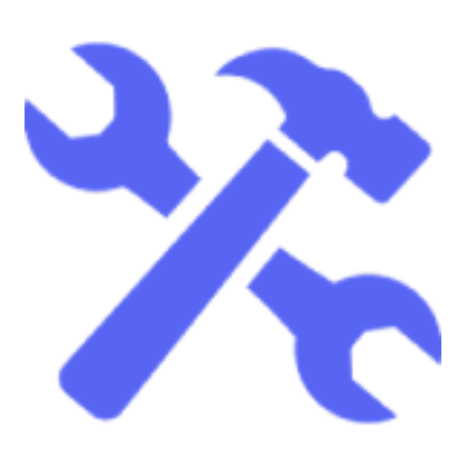

<h1 align="center"> Discord Menu Roles Bot </h1>
<p align="center">A Discord.js V14 bot that creates a select menu in your server for members to select some self roles, similar to reaction roles.</p>

## 🚧 Requirements

-  [Node.js 16.9.0+](https://nodejs.org/en/download/)
-  [Discord.js 14.0.0+](https://www.npmjs.com/package/discord.js)

## 🚀 - Get Started

Before we can run the bot, we need to complete a few steps, follow the commands below in your cmd or terminal.

1. Clone the repository

```
   git clone https://github.com/OMJO-MOJO/Discord.js-Menu-Roles.git
```

2. Navigate into the bot files

```
   cd Discord.js-Menu-Roles
```

3. Install all the necessary packages

```
   npm install
```

## ⚙ - Configuration

Rename `example.env` to `.env` and fill out all the values.

```
# Your Bot's token/secret
TOKEN=

# The default prefix for legacy commands
PREFIX=!

# The color of embeds (Replace the "#" with a "0x")
COLOR=0x5865f2
```

## 🔥 - Running your bot

```
npm run start
```

## 💻 - Commands

> The default prefix is !

-  ❓ - `!help` - Display all the commands of the bot.
-  🏓 - `!ping` - Display the bot's ping.
-  🧪 - `!new-select-menu` - Create a new select menu for a new menu role message.

## 🌍 - Misc

-  The source code is from the [Build A Bot](https://github.com/OMJO-MOJO/Bot-Builder-Docs) discord bot maker. Join the [Discord Server](https://discord.gg/YNjBuZkH4P) to create your own custom bot.
